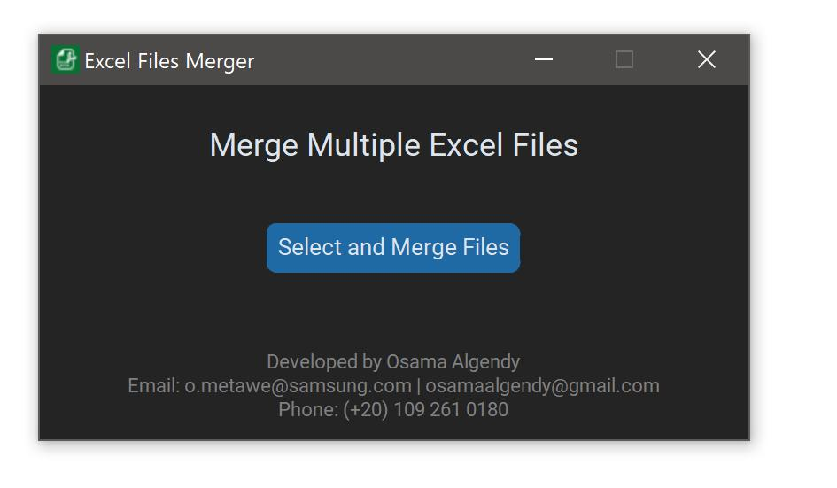

# 📊 Excel Files Merger

**Excel Files Merger** is a lightweight desktop application that allows users to quickly merge multiple Excel files into one consolidated file.

---

## 🚀 Features

- ✅ Merge multiple `.xlsx`, `.xls`, and `.xlsb` Excel files into a single file  
- ✅ Adds a “Source File” column to track the origin of each row  
- ✅ User-friendly graphical interface (GUI)  
- ✅ Supports dark mode for eye comfort  
- ✅ Export the final result to any location  
- ✅ Works offline – no internet connection required

---

## 🖥️ Screenshot

> 📸 Example preview

---

## 📦 Installation

### 🔹Download Executable

For Windows users:  
👉 Download the `.exe` file from the [Releases](https://github.com/osamaalgendy/Excel_files_merger/releases/download/v1/ExcelFilesMerger.exe) page and run directly (no installation needed).

---

## ⚙️ How It Works

1. Launch the app  
2. Click **Select and Merge Files**  
3. Choose one or more Excel files (`.xlsx`, `.xls`, `.xlsb`)  
4. The app will combine all the data into one Excel file  
5. Each row will be tagged with the original source file name  
6. Save the final merged file wherever you want  

---

## 👨‍💻 Developer

**Developed by:** Osama Algendy 
