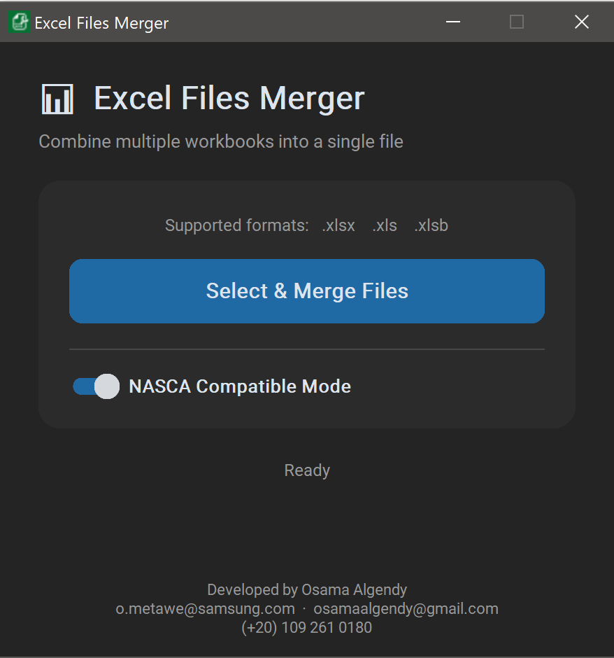

# 📊 Excel Files Merger

**Excel Files Merger** is a lightweight, cross-platform desktop app for combining multiple Excel workbooks into one clean `.xlsx` file — with every row automatically tagged by the workbook it came from.

Built for speed, clarity, and real-world corporate workflows, it gives you a modern dark-themed interface, live merge progress, and a Windows-only **NASCA Compatible Mode** for protected enterprise Excel files.

---

## 🚀 Features

- ✅ Merge multiple `.xlsx`, `.xls`, and `.xlsb` files into one consolidated `.xlsx`
- ✅ Automatically adds a **Source File** column as the first column in the output
- ✅ Modern dark-mode interface with a clean card-based layout
- ✅ Live background progress, such as `Reading 2 of 5: sales.xlsx`
- ✅ Save anywhere, with `Merged.xlsx` suggested by default
- ✅ Open the merged file immediately after a successful merge
- ✅ Works offline — no internet connection required

---

## 🛡️ NASCA Compatible Mode

Working in a Samsung-style corporate environment with **NASCA document DRM**? Excel Files Merger includes a dedicated **NASCA Compatible Mode** on Windows to handle protected workbooks that normal programmatic Excel readers cannot open.

### Why it matters

- 🔐 Opens NASCA-protected Excel files that standard readers may fail to access
- 🧩 Uses a dedicated Excel instance, so your currently open workbooks stay untouched
- 🚫 Forces VBA macros off for safer handling of untrusted files
- 📖 Opens files as read-only to avoid accidental changes
- ⚡ Reuses one hidden Excel process across the whole batch for faster large merges

> NASCA Compatible Mode is Windows-only and enabled by default on Windows builds.

---

## 🖥️ Screenshot

> 📸 Example preview

---

## 📦 Installation

### 🔹Download Executable

For Windows users:  
👉 Download the `.exe` file from the [Releases](https://github.com/osamaalgendy/Excel_files_merger/releases/download/V2/ExcelFilesMerger.exe) page and run directly (no installation needed).

---

## ⚙️ How It Works

1. Launch the app  
2. Click **Select & Merge Files**  
3. Choose one or more Excel files (`.xlsx`, `.xls`, `.xlsb`)  
4. Choose where to save the merged workbook  
5. Watch live progress while the merge runs in the background  
6. Open the finished file immediately when the merge completes  

Each output row includes a **Source File** value, so you always know exactly which workbook the data came from.

---

## 👨‍💻 Developer

**Developed by:** Osama Algendy 
